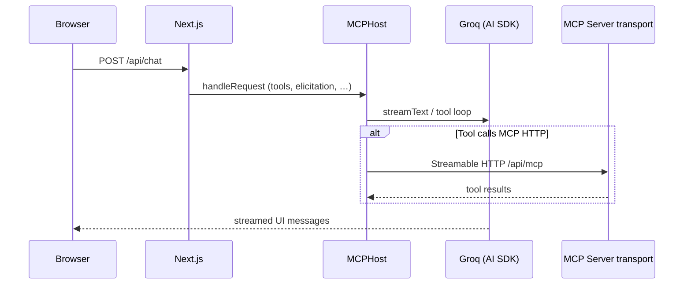
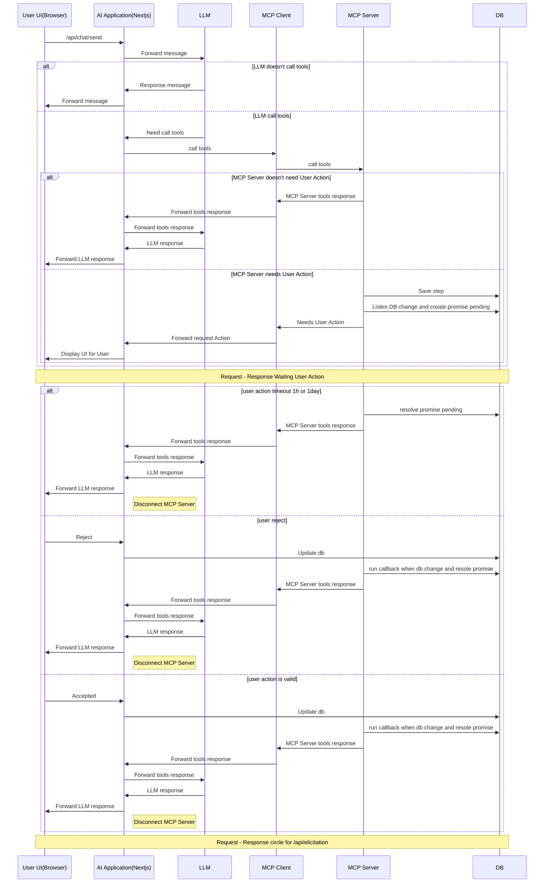

# Incident Copilot

Next.js application that combines [Groq](https://groq.com/) (via the [Vercel AI SDK](https://sdk.vercel.ai/)), the [Model Context Protocol](https://modelcontextprotocol.io/) (Streamable HTTP), and [Supabase](https://supabase.com/) for auth and data. The UI uses streaming responses, model selection, and shared workspace packages under `packages/*`.

> **Note:** The npm workspace root name in `package.json` is `chatbot-groq`; the repository folder is `incident-copilot`.

## Features

- **Streaming chat** — `POST /api/chat` handled by `MCPHost` from `@heroitvn/mcp`, integrating tools, elicitation, and Supabase-backed flows.
- **MCP over HTTP** — `GET` / `POST` / `DELETE` on `/api/mcp` using Streamable HTTP handlers (`mcp-session-id` header for sessions).
- **Elicitation updates** — `POST /api/elicitation` forwards to `updateElicitation` for in-flight MCP form elicitation.
- **Multiple Groq models** — selectable in the UI; model IDs live in `packages/chatbot-toggle/src/types/groq.ts`.
- **Auth & dashboard** — Supabase SSR, Google Sign-In / One Tap (`@heroitvn/google`), dashboard and conversation history routes.
- **Monorepo packages** — `@heroitvn/chatbot-toggle`, `@heroitvn/mcp`, `@heroitvn/supabase`, `@heroitvn/google`, `@heroitvn/shacnui`, `@heroitvn/utils` (see each package `README.md`).

## Prerequisites

- Node.js 20+ (recommended)
- [Groq API key](https://console.groq.com/)
- Supabase project (URL and keys) if you use auth, persistence, or server tools that call Supabase
- Google OAuth client ID (public) if you use Google Sign-In / One Tap

## Setup

1. Install dependencies:

   ```bash
   npm install
   ```

2. Create `.env.local` in the project root (example — adjust to your deployment):

   ```bash
   # Required for Groq
   GROQ_API_KEY=your_groq_api_key

   # Supabase (browser + server)
   NEXT_PUBLIC_SUPABASE_URL=https://your-project.supabase.co
   NEXT_PUBLIC_SUPABASE_PUBLISHABLE_KEY=your_anon_or_publishable_key

   # Optional: server-side admin usage (e.g. MCP tools)
   NEXT_PUBLIC_SUPABASE_ADMIN_KEY=your_service_role_key

   # Optional: Google Sign-In / One Tap
   NEXT_PUBLIC_GOOGLE_CLIENT_ID=your_google_oauth_client_id.apps.googleusercontent.com

   # Optional: MCP client bootstrap (see @heroitvn/mcp)
   MCP_SERVER_URL=https://your-app.example/api/mcp
   ```

3. Development server:

   ```bash
   npm run dev
   ```

4. Open [http://localhost:3000](http://localhost:3000).

## Scripts

| Command                  | Description                                      |
| ------------------------ | ------------------------------------------------ |
| `npm run dev`            | Start Next.js dev server                         |
| `npm run build`          | Build workspace packages, then production build  |
| `npm run build:packages` | Build/typecheck all workspaces that define build |
| `npm run start`          | Run production server                            |
| `npm run lint`           | Run ESLint                                       |

## Project layout

| Path                           | Role                                                               |
| ------------------------------ | ------------------------------------------------------------------ |
| `app/api/chat/route.ts`        | Chat endpoint — `MCPHost.handleRequest` + Supabase                 |
| `app/api/mcp/route.ts`         | MCP Streamable HTTP — `postHandler`, `getHandler`, `deleteHandler` |
| `app/api/elicitation/route.ts` | Elicitation continuation — `updateElicitation`                     |
| `app/(dashboard)/`             | Authenticated dashboard and history                                |
| `app/(auth)/`                  | Sign-in and auth callbacks                                         |
| `packages/chatbot-toggle/`     | Chat UI, store, Groq model types                                   |
| `packages/mcp/`                | MCP server/client helpers, `MCPHost`                               |
| `packages/supabase/`           | Browser, server, and proxy Supabase clients                        |
| `packages/google/`             | Google Sign-In and One Tap components                              |
| `packages/shacnui/`            | Shared UI primitives (`ui/*`)                                      |
| `packages/utils/`              | `cn`, Zod helpers, shared constants                                |

## Packages

Workspace packages are documented in their own README files:

- [`packages/chatbot-toggle/README.md`](packages/chatbot-toggle/README.md)
- [`packages/mcp/README.md`](packages/mcp/README.md)
- [`packages/supabase/README.md`](packages/supabase/README.md)
- [`packages/google/README.md`](packages/google/README.md)
- [`packages/shacnui/README.md`](packages/shacnui/README.md)
- [`packages/utils/README.md`](packages/utils/README.md)

## Architecture (high level)



## Details Flow

## Mermaid: end-to-end flow



## Deployment

Deploy on [Vercel](https://vercel.com/) or any Next.js-compatible host. Set all required environment variables in the provider’s dashboard; never commit real secrets.
