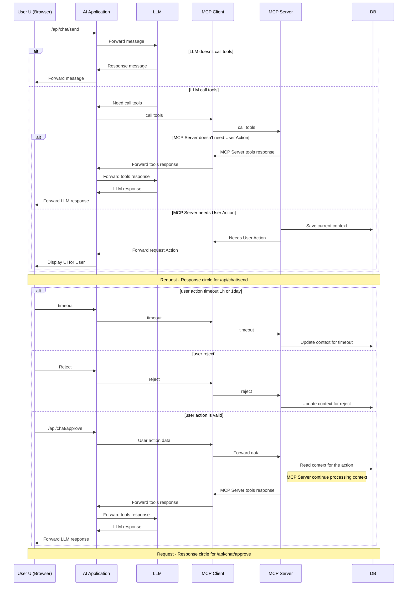

# chatbot-groq

A Next.js chat application that talks to [Groq](https://groq.com/) through the [Vercel AI SDK](https://sdk.vercel.ai/). The UI uses streaming responses, model selection, and custom chat components (ai-elements–style patterns).

## Features

- **Streaming replies** via `POST /api/chat` using `streamText` and `toUIMessageStreamResponse` (sources and reasoning channels enabled where supported).
- **Multiple Groq models** selectable in the UI (Llama, Mixtral, Qwen, DeepSeek, Kimi, and others defined in `types/groq.ts`).
- **Modern stack**: Next.js 16, React 19, TypeScript, Tailwind CSS 4, Radix UI, and Streamdown for rich message rendering.

## Prerequisites

- Node.js 20+ (recommended)
- A [Groq API key](https://console.groq.com/)

## Setup

1. Clone the repository and install dependencies:

   ```bash
   npm install
   ```

2. Create a `.env.local` file in the project root (or add to your environment):

   ```bash
   GROQ_API_KEY=your_groq_api_key_here
   ```

   The `@ai-sdk/groq` provider reads `GROQ_API_KEY` automatically.

3. Start the development server:

   ```bash
   npm run dev
   ```

4. Open [http://localhost:3000](http://localhost:3000).

## Scripts

| Command         | Description           |
| --------------- | --------------------- |
| `npm run dev`   | Start dev server      |
| `npm run build` | Production build      |
| `npm run start` | Run production server |
| `npm run lint`  | Run ESLint            |

## Project layout

- `app/api/chat/route.ts` — Groq-backed streaming chat API.
- `components/chatbot/` — Chat UI (conversation, input, model selector).
- `types/groq.ts` — Allowed Groq model IDs for the app.

## Mermaid: end-to-end flow



## Deployment

You can deploy on [Vercel](https://vercel.com/) or any host that supports Next.js. Set `GROQ_API_KEY` in the hosting provider’s environment variables; do not commit real keys to the repository.
